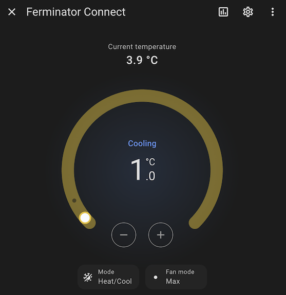

# BrewCreator integration for Home Assistant
Monitor and control your devices in [BrewCreator](https://www.brewolution.com/brewcreator-eng) such as
[Ferminator Connect](https://www.brewolution.com/ferminator-connect.html) through Home Assistant.

## Installation

- Use [HACS](https://www.hacs.xyz/docs/use/) to install the integration through the Home Assistant UI.
  Select [Custom Repositories](https://www.hacs.xyz/docs/faq/custom_repositories/) and use repository `bjorncs/ha-brewcreator` with type `Integration`.

## Contributing
Feel free to make an issue or a pull request.
Please attach [diagnostics output](https://www.home-assistant.io/docs/configuration/troubleshooting/#download-diagnostics) and relevant log if you're reporting an issue (make sure to
[enable debug logging](https://www.home-assistant.io/docs/configuration/troubleshooting/#enabling-debug-logging) prior to dumping the log).

# License
This work is licensed under the MIT license. See [LICENSE](LICENSE) for more information.